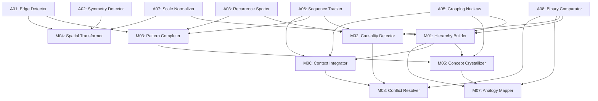

# Level 1 (Molecular) Seeds 구현 가이드

## 문서 개요

본 가이드는 Level 0 (Atomic) 시드를 조합하여 Level 1 (Molecular) 시드를 구현하기 위한 상세 지침을 제공합니다. 표준 인지 시드 설계 가이드 v1.1과 최신 연구 동향을 반영하여 작성되었습니다.

**작성일**: 2025-10-20  
**기반**: 표준 인지 시드 설계 가이드 v1.1  
**대상**: Level 1 (Molecular) 8개 시드

---

## 목차

1. [Level 1 개요](#level-1-개요)
2. [아키텍처 설계 원칙](#아키텍처-설계-원칙)
3. [최신 연구 동향](#최신-연구-동향)
4. [8개 Molecular 시드 상세 설계](#8개-molecular-시드-상세-설계)
5. [구현 전략](#구현-전략)
6. [테스트 및 평가](#테스트-및-평가)
7. [참고 문헌](#참고-문헌)

---

## Level 1 개요

### 정의

Level 1 (Molecular) 시드는 **2-3개의 Level 0 (Atomic) 시드를 조합**하여 더 복잡한 인지 기능을 수행하는 중간 단계 모듈입니다. 원자 시드의 기본 기능을 결합하여 구조적 추론, 인과 관계 파악, 패턴 완성 등의 고급 기능을 제공합니다.

### 특징

- **조합성 (Compositionality)**: 하위 시드의 기능을 조합하여 새로운 능력 창발
- **계층적 추상화**: 원자 수준보다 높은 추상화 레벨에서 동작
- **중간 복잡도**: 파라미터 수 증가, 더 복잡한 연산 수행
- **재사용성**: 상위 레벨(Level 2, 3) 시드의 구성 요소로 활용

### 수용 기준

표준 인지 시드 설계 가이드 v1.1에 따른 Level 1 수용 기준:

- **Exactness**: AMI/ARI ≥ 0.85 (구조·인과 태스크)
- **Latency**: < 10ms (CPU 기준)
- **Robustness**: 노이즈/변동에 성능 편차 < 15%
- **Bit Depth**: INT8/FP8 양자화 지원

---

## 아키텍처 설계 원칙

### 1. 시드 조합 패턴

Level 1 시드는 다음 세 가지 조합 패턴을 따릅니다.

#### (1) 순차적 조합 (Sequential Composition)
```
Input → Seed_A → Seed_B → Output
```
- 한 시드의 출력이 다음 시드의 입력으로 전달
- 예: Pattern Completer (A03 → A06 → A01)

#### (2) 병렬 조합 (Parallel Composition)
```
        ┌─ Seed_A ─┐
Input ──┼─ Seed_B ─┼─→ Fusion → Output
        └─ Seed_C ─┘
```
- 여러 시드가 동일한 입력을 병렬로 처리
- 결과를 융합 모듈에서 통합
- 예: Analogy Mapper (M01 + A08 + M05)

#### (3) 계층적 조합 (Hierarchical Composition)
```
Input → Seed_A → Intermediate
              ↓
        Seed_B → Seed_C → Output
```
- 상위 시드가 하위 시드를 제어
- 조건부 실행 또는 주의 메커니즘 활용
- 예: Context Integrator (A06 + M01 + A05)

### 2. 융합 메커니즘

여러 시드의 출력을 결합하는 방법:

#### (1) Attention-based Fusion
```python
def attention_fusion(outputs: List[Tensor]) -> Tensor:
    # 각 시드 출력에 대한 주의 가중치 계산
    attention_weights = softmax(attention_net(concat(outputs)))
    # 가중 합
    fused = sum(w * out for w, out in zip(attention_weights, outputs))
    return fused
```

#### (2) Gated Fusion
```python
def gated_fusion(outputs: List[Tensor]) -> Tensor:
    # 게이트 값 계산
    gates = sigmoid(gate_net(concat(outputs)))
    # 게이트 적용
    fused = sum(g * out for g, out in zip(gates, outputs))
    return fused
```

#### (3) Residual Fusion
```python
def residual_fusion(base: Tensor, enhancements: List[Tensor]) -> Tensor:
    # 기본 출력에 향상 정보 추가
    fused = base + sum(enhancements)
    return fused
```

### 3. 계산 그래프 구성

Level 1 시드는 **동적 계산 그래프 (Dynamic Computation Graph)**를 사용하여 구현됩니다.

```python
class MolecularSeed(BaseSeed):
    def __init__(self, config: SeedConfig, atomic_seeds: List[BaseSeed]):
        super().__init__(config)
        self.atomic_seeds = atomic_seeds
        self.composition_graph = self.build_graph()
        self.fusion_module = self.build_fusion()
    
    def build_graph(self) -> ComputationGraph:
        """시드 간 의존성을 나타내는 DAG 구축"""
        pass
    
    def forward(self, x: Tensor) -> Tensor:
        """계산 그래프를 따라 순차/병렬 실행"""
        pass
```

---

## 최신 연구 동향

Level 1 시드 구현에 참고할 최신 연구 성과를 정리합니다.

### 1. Hierarchical Reasoning Model (HRM, 2025)

**출처**: Wang et al., "Hierarchical Reasoning Model", arXiv:2506.21734, 2025

**핵심 아이디어**:
- 인간 뇌의 계층적·다중 시간 스케일 처리에서 영감
- 고수준 모듈(느린 추상 계획)과 저수준 모듈(빠른 상세 계산)의 상호의존적 순환 구조
- 단일 forward pass로 순차적 추론 수행, 중간 과정의 명시적 감독 불필요

**Level 1 적용**:
- **M01 (Hierarchy Builder)**: 고수준-저수준 모듈 구조 차용
- **M02 (Causality Detector)**: 순환 구조를 통한 인과 관계 추론
- **M08 (Conflict Resolver)**: 계층적 제약 해소 메커니즘

**구현 힌트**:
```python
class HierarchicalModule(nn.Module):
    def __init__(self, high_dim, low_dim):
        self.high_level = nn.GRU(high_dim, high_dim)  # 느린 추상 계획
        self.low_level = nn.GRU(low_dim, low_dim)     # 빠른 상세 계산
        self.high_to_low = nn.Linear(high_dim, low_dim)
        self.low_to_high = nn.Linear(low_dim, high_dim)
    
    def forward(self, x):
        # 고수준 계획
        high_state = self.high_level(x)
        # 저수준 실행 (고수준 가이드)
        low_input = self.high_to_low(high_state)
        low_state = self.low_level(low_input)
        # 피드백
        high_feedback = self.low_to_high(low_state)
        return high_state + high_feedback
```

### 2. Compositional Meta-Learning (2025)

**출처**: Bakermans et al., "Compositional meta-learning through probabilistic task representations", arXiv:2510.01858, 2025

**핵심 아이디어**:
- 확률적 생성 모델에서 조합적 메타학습을 추론으로 정식화
- 순환 모듈과 게이팅 함수를 통한 태스크 표현 학습
- 새로운 태스크에 대한 빠른 적응

**Level 1 적용**:
- **M05 (Concept Crystallizer)**: 프로토타입 학습을 위한 메타학습 접근
- **M06 (Context Integrator)**: 맥락 기반 게이팅 메커니즘
- **M07 (Analogy Mapper)**: 구조적 유사성 학습

### 3. Modular Dynamic Neural Networks (2021-2025)

**출처**: Turner et al., "Modular Dynamic Neural Network: A Continual Learning Architecture", Applied Sciences, 2021

**핵심 아이디어**:
- 학습하면서 성장하고 재배치되는 모듈식 서브네트워크
- 트리 구조로 자기 조직화
- 지속적 학습 (Continual Learning) 지원

**Level 1 적용**:
- **M01 (Hierarchy Builder)**: 동적 트리 구조 구축
- **M03 (Pattern Completer)**: 점진적 패턴 학습

### 4. Causal Inference with Deep Learning (2024)

**출처**: Jiao et al., "Causal Inference Meets Deep Learning: A Comprehensive Survey", Research, 2024

**핵심 아이디어**:
- 딥러닝에서 인과 추론 방법론 통합
- 구조적 인과 모델 (SCM)과 신경망 결합
- 반사실 추론 (Counterfactual Reasoning) 지원

**Level 1 적용**:
- **M02 (Causality Detector)**: 인과 구조 학습을 위한 신경망 설계
- **M08 (Conflict Resolver)**: 인과 제약 기반 충돌 해소

### 5. Equivariant Neural Networks (2019-2025)

**출처**: Tai et al., "Equivariant Transformer Networks", ICML 2019; Batzner et al., "E(3)-equivariant graph neural networks", Nature Communications, 2022

**핵심 아이디어**:
- 물리적 대칭성을 보존하는 신경망
- 회전, 평행이동, 스케일 변환에 대한 등변성 (Equivariance)
- 샘플 효율성 향상

**Level 1 적용**:
- **M04 (Spatial Transformer)**: 등변성 보장 변환 네트워크
- **M07 (Analogy Mapper)**: 구조 보존 매핑

### 6. Pattern Completion in Neural Networks (2025)

**출처**: Shin et al., "Recurrent pattern completion drives the neocortical mechanism", Nature Neuroscience, 2025

**핵심 아이디어**:
- 신피질의 감각 추론 메커니즘
- 순환 패턴 완성 (Recurrent Pattern Completion)
- 대규모 신경생리학적 방법론

**Level 1 적용**:
- **M03 (Pattern Completer)**: 순환 구조를 통한 패턴 보간/외삽

---

## 8개 Molecular 시드 상세 설계

### SEED-M01 — Hierarchy Builder

**Category**: Relation  
**Bit**: INT8/FP8  
**Target Params**: ~500K  
**Composed From**: A05 (Grouping Nucleus) + A08 (Binary Comparator) + A07 (Scale Normalizer)

#### 목적
상하/포함 관계를 파악하여 트리 또는 DAG(Directed Acyclic Graph) 구조를 구축합니다.

#### 아키텍처 설계

```python
class HierarchyBuilder(MolecularSeed):
    """
    SEED-M01: Hierarchy Builder
    
    상하 관계를 파악하여 계층 구조를 구축합니다.
    """
    
    def __init__(self, input_dim: int = 128):
        # Atomic seeds
        self.grouping = GroupingNucleus(input_dim, num_clusters=16)  # A05
        self.comparator = BinaryComparator(input_dim)                # A08
        self.normalizer = ScaleNormalizer(input_dim)                 # A07
        
        # Hierarchy construction network
        self.hierarchy_encoder = nn.Sequential(
            nn.Linear(input_dim * 2, 256),
            nn.ReLU(),
            nn.Linear(256, input_dim)
        )
        
        # Parent-child relationship predictor
        self.relation_predictor = nn.Sequential(
            nn.Linear(input_dim * 2, 128),
            nn.ReLU(),
            nn.Linear(128, 1),
            nn.Sigmoid()  # 부모-자식 관계 확률
        )
    
    def forward(self, x: Tensor) -> Tensor:
        """
        Args:
            x: [B, N, D] - N개 노드의 특징
        Returns:
            hierarchy: [B, N, D] - 계층 정보가 인코딩된 특징
        """
        # 1. 스케일 정규화
        x_norm = self.normalizer(x)
        
        # 2. 초기 그룹화 (클러스터링)
        clusters = self.grouping.get_cluster_assignments(x_norm)
        
        # 3. 쌍별 비교로 상하 관계 파악
        hierarchy_matrix = self.build_hierarchy_matrix(x_norm)
        
        # 4. 계층 정보 인코딩
        hierarchy_features = self.encode_hierarchy(x_norm, hierarchy_matrix)
        
        return hierarchy_features
    
    def build_hierarchy_matrix(self, x: Tensor) -> Tensor:
        """
        N x N 계층 관계 행렬 구축
        matrix[i, j] = 1 if i is parent of j
        """
        B, N, D = x.shape
        hierarchy_matrix = torch.zeros(B, N, N, device=x.device)
        
        for i in range(N):
            for j in range(N):
                if i != j:
                    # i와 j 비교
                    pair = torch.cat([x[:, i, :], x[:, j, :]], dim=-1)
                    relation_prob = self.relation_predictor(pair)
                    hierarchy_matrix[:, i, j] = relation_prob.squeeze(-1)
        
        return hierarchy_matrix
    
    def get_tree_structure(self, x: Tensor) -> Dict[str, Any]:
        """
        트리 구조 추출
        
        Returns:
            {
                'adjacency_matrix': [B, N, N],
                'levels': [B, N],  # 각 노드의 레벨
                'roots': [B, K]    # 루트 노드 인덱스
            }
        """
        hierarchy_matrix = self.build_hierarchy_matrix(x)
        
        # 인접 행렬 (임계값 적용)
        adjacency = (hierarchy_matrix > 0.5).float()
        
        # 레벨 계산 (루트로부터의 거리)
        levels = self.compute_levels(adjacency)
        
        # 루트 노드 (부모가 없는 노드)
        has_parent = adjacency.sum(dim=1) > 0
        roots = (~has_parent).nonzero(as_tuple=True)[1]
        
        return {
            'adjacency_matrix': adjacency,
            'levels': levels,
            'roots': roots
        }
```

#### 훈련 목표
- **계층 복원 손실**: 실제 계층 구조와의 차이 최소화
- **일관성 손실**: 추이성 (A > B, B > C ⇒ A > C) 보장
- **균형 손실**: 트리의 균형도 유지

#### 평가 메트릭
- Tree Edit Distance
- 층위 일관성 (Level Consistency)
- 계층 복원율 (Hierarchy Recovery Rate)

---

### SEED-M02 — Causality Detector

**Category**: Temporal/Logic  
**Bit**: FP8  
**Target Params**: ~600K  
**Composed From**: A06 (Sequence Tracker) + A03 (Recurrence Spotter) + A08 (Binary Comparator)

#### 목적
시간적 선후 관계와 개입 효과를 기반으로 인과 구조를 추정합니다.

#### 아키텍처 설계

```python
class CausalityDetector(MolecularSeed):
    """
    SEED-M02: Causality Detector
    
    시간적 패턴과 개입 효과를 분석하여 인과 관계를 추정합니다.
    """
    
    def __init__(self, input_dim: int = 128):
        # Atomic seeds
        self.sequence_tracker = SequenceTracker(input_dim)      # A06
        self.recurrence_spotter = RecurrenceSpotter(input_dim)  # A03
        self.comparator = BinaryComparator(input_dim)           # A08
        
        # Causal inference network
        self.causal_encoder = nn.Sequential(
            nn.Linear(input_dim * 3, 256),
            nn.ReLU(),
            nn.Linear(256, input_dim)
        )
        
        # Causal graph predictor (DAG)
        self.graph_predictor = nn.Sequential(
            nn.Linear(input_dim * 2, 128),
            nn.ReLU(),
            nn.Linear(128, 1),
            nn.Sigmoid()  # 인과 관계 확률
        )
        
        # Intervention effect estimator
        self.intervention_net = nn.Sequential(
            nn.Linear(input_dim * 2, 128),
            nn.ReLU(),
            nn.Linear(128, input_dim)
        )
    
    def forward(self, x: Tensor, interventions: Optional[Tensor] = None) -> Tensor:
        """
        Args:
            x: [B, T, D] - 시계열 데이터
            interventions: [B, T, D] - 개입 정보 (선택)
        Returns:
            causal_features: [B, T, D] - 인과 정보가 인코딩된 특징
        """
        # 1. 시간적 패턴 추적
        temporal_features = self.sequence_tracker(x)
        
        # 2. 반복 패턴 검출 (주기성)
        recurrence_features = self.recurrence_spotter(x)
        
        # 3. 선후 관계 비교
        precedence_features = self.analyze_precedence(x)
        
        # 4. 특징 융합
        combined = torch.cat([
            temporal_features,
            recurrence_features,
            precedence_features
        ], dim=-1)
        
        causal_features = self.causal_encoder(combined)
        
        # 5. 개입 효과 추정 (있는 경우)
        if interventions is not None:
            intervention_effect = self.estimate_intervention_effect(
                causal_features, interventions
            )
            causal_features = causal_features + intervention_effect
        
        return causal_features
    
    def estimate_causal_graph(self, x: Tensor) -> Tensor:
        """
        인과 그래프 (DAG) 추정
        
        Args:
            x: [B, T, D]
        Returns:
            causal_graph: [B, D, D] - 인과 관계 행렬
        """
        B, T, D = x.shape
        
        # 각 변수 쌍에 대해 인과 관계 추정
        causal_graph = torch.zeros(B, D, D, device=x.device)
        
        for i in range(D):
            for j in range(D):
                if i != j:
                    # 변수 i와 j의 시계열 추출
                    var_i = x[:, :, i:i+1]  # [B, T, 1]
                    var_j = x[:, :, j:j+1]  # [B, T, 1]
                    
                    # Granger causality 기반 분석
                    causality_score = self.granger_causality_test(var_i, var_j)
                    causal_graph[:, i, j] = causality_score
        
        # DAG 제약 적용 (비순환성)
        causal_graph = self.enforce_dag_constraint(causal_graph)
        
        return causal_graph
    
    def granger_causality_test(self, x: Tensor, y: Tensor) -> Tensor:
        """
        Granger 인과성 테스트 (신경망 기반)
        
        x가 y의 원인인지 테스트
        """
        # x와 y를 결합하여 예측
        combined = torch.cat([x, y], dim=-1)
        
        # 다음 시점의 y 예측
        y_pred_with_x = self.sequence_tracker.predict_next(combined, num_steps=1)
        y_pred_without_x = self.sequence_tracker.predict_next(y, num_steps=1)
        
        # 예측 개선 정도를 인과성 점수로 사용
        improvement = F.mse_loss(y_pred_without_x, y[:, -1:, :]) - \
                     F.mse_loss(y_pred_with_x, y[:, -1:, :])
        
        causality_score = torch.sigmoid(improvement)
        
        return causality_score.mean(dim=[1, 2])
```

#### 훈련 목표
- **인과 그래프 복원 손실**: 실제 인과 구조와의 차이
- **DAG 제약 손실**: 비순환성 보장
- **개입 예측 손실**: 개입 효과 정확도

#### 평가 메트릭
- Structural Hamming Distance (SHD)
- Precision/Recall on causal edges
- Intervention prediction accuracy

---

### SEED-M03 — Pattern Completer

**Category**: Pattern  
**Bit**: FP8  
**Target Params**: ~550K  
**Composed From**: A03 (Recurrence Spotter) + A06 (Sequence Tracker) + A01 (Edge Detector)

#### 목적
결손된 패턴을 보간(interpolation)하거나 외삽(extrapolation)하여 완성합니다.

#### 아키텍처 설계

```python
class PatternCompleter(MolecularSeed):
    """
    SEED-M03: Pattern Completer
    
    결손 패턴을 보간/외삽하여 완성합니다.
    """
    
    def __init__(self, input_dim: int = 128):
        # Atomic seeds
        self.recurrence_spotter = RecurrenceSpotter(input_dim)  # A03
        self.sequence_tracker = SequenceTracker(input_dim)      # A06
        self.edge_detector = EdgeDetector(input_dim)            # A01
        
        # Pattern completion network
        self.completion_encoder = nn.TransformerEncoder(
            nn.TransformerEncoderLayer(
                d_model=input_dim,
                nhead=8,
                dim_feedforward=512,
                dropout=0.1
            ),
            num_layers=4
        )
        
        # Mask predictor
        self.mask_predictor = nn.Sequential(
            nn.Linear(input_dim, 64),
            nn.ReLU(),
            nn.Linear(64, 1),
            nn.Sigmoid()
        )
        
        # Completion generator
        self.completion_generator = nn.Sequential(
            nn.Linear(input_dim * 2, 256),
            nn.ReLU(),
            nn.Linear(256, input_dim)
        )
    
    def forward(self, x: Tensor, mask: Optional[Tensor] = None) -> Tensor:
        """
        Args:
            x: [B, L, D] - 입력 시퀀스 (일부 결손 가능)
            mask: [B, L] - 결손 위치 (1=관측, 0=결손)
        Returns:
            completed: [B, L, D] - 완성된 시퀀스
        """
        # 1. 결손 위치 자동 감지 (mask가 없는 경우)
        if mask is None:
            mask = self.detect_missing_positions(x)
        
        # 2. 반복 패턴 분석
        recurrence_info = self.recurrence_spotter(x * mask.unsqueeze(-1))
        period = self.recurrence_spotter.detect_period(x * mask.unsqueeze(-1))
        
        # 3. 시퀀스 추세 파악
        sequence_info = self.sequence_tracker(x * mask.unsqueeze(-1))
        
        # 4. 경계 검출 (패턴 전환점)
        edge_info = self.edge_detector(x * mask.unsqueeze(-1))
        
        # 5. 특징 융합
        combined = recurrence_info + sequence_info + edge_info
        
        # 6. Transformer 기반 패턴 완성
        # 위치 인코딩 추가
        pos_encoding = self.get_positional_encoding(x.size(1), x.device)
        combined_with_pos = combined + pos_encoding
        
        # Self-attention으로 전체 맥락 활용
        encoded = self.completion_encoder(
            combined_with_pos.transpose(0, 1)
        ).transpose(0, 1)
        
        # 7. 결손 부분 생성
        completed = self.generate_missing_parts(x, encoded, mask)
        
        return completed
    
    def detect_missing_positions(self, x: Tensor) -> Tensor:
        """
        결손 위치 자동 감지
        
        Returns:
            mask: [B, L] - 1=관측, 0=결손
        """
        # 이상치 검출 기반
        magnitude = torch.norm(x, dim=-1)
        threshold = magnitude.mean(dim=1, keepdim=True) * 0.1
        mask = (magnitude > threshold).float()
        
        return mask
    
    def generate_missing_parts(self, x: Tensor, encoded: Tensor, 
                               mask: Tensor) -> Tensor:
        """
        결손 부분 생성
        """
        # 관측된 부분과 인코딩 정보 결합
        combined = torch.cat([x, encoded], dim=-1)
        generated = self.completion_generator(combined)
        
        # 마스크 적용: 관측된 부분은 유지, 결손 부분은 생성
        completed = x * mask.unsqueeze(-1) + generated * (1 - mask.unsqueeze(-1))
        
        return completed
    
    def interpolate(self, x: Tensor, missing_indices: List[int]) -> Tensor:
        """
        특정 위치 보간
        """
        mask = torch.ones(x.size(0), x.size(1), device=x.device)
        mask[:, missing_indices] = 0
        
        return self.forward(x, mask)
    
    def extrapolate(self, x: Tensor, num_steps: int) -> Tensor:
        """
        미래 패턴 외삽
        """
        # 시퀀스 추적기를 사용한 예측
        predictions = self.sequence_tracker.predict_next(x, num_steps=num_steps)
        
        # 반복 패턴 정보 활용하여 보정
        period = self.recurrence_spotter.detect_period(x)
        period_adjusted = self.adjust_by_periodicity(predictions, period)
        
        return period_adjusted
```

#### 훈련 목표
- **재구성 손실**: 원본 패턴과의 MSE
- **구조 보존 손실**: 패턴의 주기성, 대칭성 유지
- **일관성 손실**: 관측 부분과 생성 부분의 경계 매끄러움

#### 평가 메트릭
- Mean Squared Error (MSE)
- Structural Similarity Index (SSIM)
- Pattern coherence score

---

### SEED-M04 — Spatial Transformer

**Category**: Spatial  
**Bit**: FP8  
**Target Params**: ~450K  
**Composed From**: A02 (Symmetry Detector) + A07 (Scale Normalizer) + A01 (Edge Detector)

#### 목적
회전, 스케일, 평행이동 등의 공간 변환을 수행하여 입력을 정렬합니다.

#### 아키텍처 설계

```python
class SpatialTransformer(MolecularSeed):
    """
    SEED-M04: Spatial Transformer
    
    공간 변환을 통해 입력을 정규 좌표계로 정렬합니다.
    """
    
    def __init__(self, input_dim: int = 128):
        # Atomic seeds
        self.symmetry_detector = SymmetryDetector(input_dim)  # A02
        self.scale_normalizer = ScaleNormalizer(input_dim)    # A07
        self.edge_detector = EdgeDetector(input_dim)          # A01
        
        # Transformation parameter predictor
        self.transform_predictor = nn.Sequential(
            nn.Linear(input_dim, 256),
            nn.ReLU(),
            nn.Linear(256, 6)  # [tx, ty, rotation, scale_x, scale_y, shear]
        )
        
        # Equivariant feature extractor
        self.equivariant_encoder = self.build_equivariant_encoder(input_dim)
    
    def build_equivariant_encoder(self, dim: int) -> nn.Module:
        """
        E(2) 등변 인코더 구축
        """
        # 간단한 등변 레이어
        return nn.Sequential(
            nn.Linear(dim, dim),
            nn.LayerNorm(dim),
            nn.ReLU()
        )
    
    def forward(self, x: Tensor) -> Tuple[Tensor, Dict[str, Tensor]]:
        """
        Args:
            x: [B, L, D] - 입력 특징
        Returns:
            transformed: [B, L, D] - 변환된 특징
            params: 변환 파라미터 딕셔너리
        """
        # 1. 대칭성 분석
        symmetry_types, symmetry_axis = self.symmetry_detector.detect_symmetry_type(x)
        
        # 2. 스케일 정규화
        x_normalized = self.scale_normalizer(x)
        estimated_scale = self.scale_normalizer.estimate_scale(x)
        
        # 3. 경계 검출 (변환 기준점)
        edges = self.edge_detector.detect_edges(x_normalized)
        
        # 4. 변환 파라미터 예측
        # 전역 풀링으로 전체 정보 집약
        global_features = x_normalized.mean(dim=1)  # [B, D]
        transform_params = self.transform_predictor(global_features)  # [B, 6]
        
        # 5. 변환 적용
        transformed = self.apply_transformation(x_normalized, transform_params)
        
        # 6. 등변성 보장 인코딩
        transformed = self.equivariant_encoder(transformed)
        
        params = {
            'translation': transform_params[:, :2],
            'rotation': transform_params[:, 2],
            'scale': transform_params[:, 3:5],
            'shear': transform_params[:, 5],
            'symmetry_axis': symmetry_axis,
            'estimated_scale': estimated_scale
        }
        
        return transformed, params
    
    def apply_transformation(self, x: Tensor, params: Tensor) -> Tensor:
        """
        아핀 변환 적용
        
        Args:
            x: [B, L, D]
            params: [B, 6] - [tx, ty, rotation, scale_x, scale_y, shear]
        """
        B, L, D = x.shape
        
        # 2D 좌표로 해석 (D 차원을 D/2개의 2D 포인트로)
        x_2d = x.view(B, L, D // 2, 2)
        
        # 아핀 변환 행렬 구성
        tx, ty = params[:, 0], params[:, 1]
        theta = params[:, 2]
        sx, sy = params[:, 3], params[:, 4]
        shear = params[:, 5]
        
        # 회전 행렬
        cos_theta = torch.cos(theta)
        sin_theta = torch.sin(theta)
        
        # 스케일 행렬
        # 전단 행렬
        # 결합된 변환 행렬
        affine_matrix = torch.zeros(B, 2, 3, device=x.device)
        affine_matrix[:, 0, 0] = sx * cos_theta
        affine_matrix[:, 0, 1] = -sy * sin_theta + shear
        affine_matrix[:, 0, 2] = tx
        affine_matrix[:, 1, 0] = sx * sin_theta
        affine_matrix[:, 1, 1] = sy * cos_theta
        affine_matrix[:, 1, 2] = ty
        
        # 변환 적용
        x_2d_flat = x_2d.view(B, L * D // 2, 2)
        
        # 동차 좌표로 변환
        ones = torch.ones(B, L * D // 2, 1, device=x.device)
        x_homogeneous = torch.cat([x_2d_flat, ones], dim=-1)  # [B, L*D/2, 3]
        
        # 행렬 곱
        transformed_2d = torch.bmm(x_homogeneous, affine_matrix.transpose(1, 2))
        
        # 원래 형태로 복원
        transformed = transformed_2d.view(B, L, D)
        
        return transformed
    
    def align_to_canonical(self, x: Tensor) -> Tensor:
        """
        정규 좌표계로 정렬
        """
        transformed, params = self.forward(x)
        return transformed
    
    def estimate_pose(self, x: Tensor) -> Dict[str, Tensor]:
        """
        입력의 포즈 (위치, 방향, 스케일) 추정
        """
        _, params = self.forward(x)
        return params
```

#### 훈련 목표
- **등변성 손실**: 변환 후에도 특징이 일관되게 유지
- **정렬 손실**: 정규 좌표계로의 정렬 정확도
- **재구성 손실**: 역변환 후 원본 복원

#### 평가 메트릭
- Pose estimation accuracy
- Alignment error
- Equivariance score

---

### SEED-M05 — Concept Crystallizer

**Category**: Abstraction  
**Bit**: FP8  
**Target Params**: ~700K  
**Composed From**: A05 (Grouping Nucleus) + M03 (Pattern Completer) + M01 (Hierarchy Builder)

**참고**: M03와 M01은 Level 1 시드이므로, 구현 순서상 M05는 M01, M03 이후에 구현됩니다.

#### 목적
예시들로부터 프로토타입과 멤버십 함수를 학습하여 개념을 추상화합니다.

#### 아키텍처 설계

```python
class ConceptCrystallizer(MolecularSeed):
    """
    SEED-M05: Concept Crystallizer
    
    예시로부터 프로토타입을 학습하여 개념을 형성합니다.
    """
    
    def __init__(self, input_dim: int = 128, num_concepts: int = 32):
        # Atomic/Molecular seeds
        self.grouping = GroupingNucleus(input_dim, num_clusters=num_concepts)
        self.pattern_completer = PatternCompleter(input_dim)
        self.hierarchy_builder = HierarchyBuilder(input_dim)
        
        self.num_concepts = num_concepts
        
        # Prototype learner
        self.prototypes = nn.Parameter(torch.randn(num_concepts, input_dim))
        
        # Membership function
        self.membership_net = nn.Sequential(
            nn.Linear(input_dim * 2, 128),
            nn.ReLU(),
            nn.Linear(128, 1),
            nn.Sigmoid()
        )
        
        # Concept hierarchy encoder
        self.concept_hierarchy = nn.Sequential(
            nn.Linear(input_dim, 256),
            nn.ReLU(),
            nn.Linear(256, input_dim)
        )
    
    def forward(self, x: Tensor, examples: Optional[List[Tensor]] = None) -> Tensor:
        """
        Args:
            x: [B, N, D] - 입력 예시들
            examples: 추가 예시 (few-shot 학습용)
        Returns:
            concepts: [B, N, D] - 개념 표현
        """
        # 1. 그룹화 (유사한 예시들 클러스터링)
        cluster_assignments = self.grouping.get_cluster_assignments(x)
        
        # 2. 각 클러스터의 프로토타입 업데이트
        self.update_prototypes(x, cluster_assignments)
        
        # 3. 패턴 완성 (부분 예시로부터 전체 개념 추론)
        if examples is not None:
            completed_concepts = []
            for ex in examples:
                completed = self.pattern_completer(ex.unsqueeze(0))
                completed_concepts.append(completed)
            x = torch.cat([x] + completed_concepts, dim=1)
        
        # 4. 개념 계층 구축
        concept_hierarchy = self.hierarchy_builder(x)
        
        # 5. 멤버십 계산
        membership = self.compute_membership(x)
        
        # 6. 개념 표현 생성
        concepts = self.generate_concept_representation(x, membership, concept_hierarchy)
        
        return concepts
    
    def update_prototypes(self, x: Tensor, assignments: Tensor):
        """
        프로토타입 업데이트 (온라인 학습)
        """
        B, N, D = x.shape
        K = self.num_concepts
        
        for k in range(K):
            # k번째 클러스터에 속하는 샘플들의 가중 평균
            weights = assignments[:, :, k].unsqueeze(-1)  # [B, N, 1]
            weighted_sum = (x * weights).sum(dim=1)  # [B, D]
            weight_sum = weights.sum(dim=1) + 1e-8  # [B, 1]
            
            cluster_mean = (weighted_sum / weight_sum).mean(dim=0)  # [D]
            
            # 지수 이동 평균으로 프로토타입 업데이트
            momentum = 0.9
            self.prototypes.data[k] = momentum * self.prototypes.data[k] + \
                                     (1 - momentum) * cluster_mean
    
    def compute_membership(self, x: Tensor) -> Tensor:
        """
        각 샘플의 개념 멤버십 계산
        
        Returns:
            membership: [B, N, K] - 각 개념에 대한 멤버십
        """
        B, N, D = x.shape
        K = self.num_concepts
        
        membership = torch.zeros(B, N, K, device=x.device)
        
        for k in range(K):
            prototype = self.prototypes[k].unsqueeze(0).unsqueeze(0)  # [1, 1, D]
            prototype_expanded = prototype.expand(B, N, D)
            
            # 샘플과 프로토타입 결합
            pair = torch.cat([x, prototype_expanded], dim=-1)  # [B, N, D*2]
            
            # 멤버십 계산
            membership[:, :, k] = self.membership_net(pair).squeeze(-1)
        
        return membership
    
    def few_shot_learn(self, support_set: Tensor, query_set: Tensor) -> Tensor:
        """
        Few-shot 학습
        
        Args:
            support_set: [K, S, D] - K개 클래스, 각 S개 예시
            query_set: [B, D] - 쿼리 샘플들
        Returns:
            predictions: [B, K] - 각 클래스에 대한 확률
        """
        K, S, D = support_set.shape
        
        # 각 클래스의 프로토타입 계산
        class_prototypes = support_set.mean(dim=1)  # [K, D]
        
        # 쿼리와 프로토타입 간 거리
        distances = torch.cdist(query_set, class_prototypes)  # [B, K]
        
        # 소프트맥스로 확률 변환
        predictions = F.softmax(-distances, dim=-1)
        
        return predictions
```

#### 훈련 목표
- **프로토타입 손실**: 클러스터 내 분산 최소화
- **멤버십 손실**: 명확한 경계 형성
- **Few-shot 정확도**: 적은 예시로 새 개념 학습

#### 평가 메트릭
- Few-shot classification accuracy
- Prototype quality (intra/inter-cluster distance ratio)
- Concept boundary clarity

---

### SEED-M06 — Context Integrator

**Category**: Composition  
**Bit**: FP8  
**Target Params**: ~650K  
**Composed From**: A06 (Sequence Tracker) + M01 (Hierarchy Builder) + A05 (Grouping Nucleus)

#### 목적
국소적 맥락과 전역적 맥락을 융합하여 중의성을 해소하고 이해를 향상시킵니다.

#### 아키텍처 설계

```python
class ContextIntegrator(MolecularSeed):
    """
    SEED-M06: Context Integrator
    
    다층적 맥락을 통합하여 중의성을 해소합니다.
    """
    
    def __init__(self, input_dim: int = 128):
        # Atomic/Molecular seeds
        self.sequence_tracker = SequenceTracker(input_dim)
        self.hierarchy_builder = HierarchyBuilder(input_dim)
        self.grouping = GroupingNucleus(input_dim)
        
        # Multi-scale context encoder
        self.local_context_encoder = nn.TransformerEncoder(
            nn.TransformerEncoderLayer(d_model=input_dim, nhead=8),
            num_layers=2
        )
        
        self.global_context_encoder = nn.TransformerEncoder(
            nn.TransformerEncoderLayer(d_model=input_dim, nhead=8),
            num_layers=2
        )
        
        # Context fusion
        self.context_fusion = nn.MultiheadAttention(
            embed_dim=input_dim,
            num_heads=8
        )
        
        # Disambiguation network
        self.disambiguator = nn.Sequential(
            nn.Linear(input_dim * 3, 256),
            nn.ReLU(),
            nn.Linear(256, input_dim)
        )
    
    def forward(self, x: Tensor, context_window: int = 5) -> Tensor:
        """
        Args:
            x: [B, L, D] - 입력 시퀀스
            context_window: 국소 맥락 윈도우 크기
        Returns:
            integrated: [B, L, D] - 맥락이 통합된 표현
        """
        # 1. 시간적 맥락 (시퀀스 추적)
        temporal_context = self.sequence_tracker(x)
        
        # 2. 계층적 맥락 (구조 파악)
        hierarchical_context = self.hierarchy_builder(x)
        
        # 3. 그룹 맥락 (유사성 기반)
        group_context = self.grouping(x)
        
        # 4. 국소 맥락 인코딩
        local_context = self.encode_local_context(x, context_window)
        
        # 5. 전역 맥락 인코딩
        global_context = self.encode_global_context(x)
        
        # 6. 맥락 융합
        fused_context = self.fuse_contexts(
            local_context,
            global_context,
            temporal_context,
            hierarchical_context,
            group_context
        )
        
        # 7. 중의성 해소
        integrated = self.disambiguate(x, fused_context)
        
        return integrated
    
    def encode_local_context(self, x: Tensor, window_size: int) -> Tensor:
        """
        슬라이딩 윈도우 기반 국소 맥락 인코딩
        """
        B, L, D = x.shape
        
        # 패딩
        padded = F.pad(x, (0, 0, window_size // 2, window_size // 2))
        
        # 슬라이딩 윈도우
        local_contexts = []
        for i in range(L):
            window = padded[:, i:i+window_size, :]
            local_contexts.append(window)
        
        local_contexts = torch.stack(local_contexts, dim=1)  # [B, L, window_size, D]
        
        # Transformer 인코딩
        local_contexts_flat = local_contexts.view(B * L, window_size, D)
        encoded = self.local_context_encoder(
            local_contexts_flat.transpose(0, 1)
        ).transpose(0, 1)
        
        # 평균 풀링
        local_context = encoded.mean(dim=1).view(B, L, D)
        
        return local_context
    
    def encode_global_context(self, x: Tensor) -> Tensor:
        """
        전체 시퀀스를 고려한 전역 맥락 인코딩
        """
        # Transformer 인코딩
        global_context = self.global_context_encoder(
            x.transpose(0, 1)
        ).transpose(0, 1)
        
        return global_context
    
    def fuse_contexts(self, local: Tensor, global_ctx: Tensor,
                     temporal: Tensor, hierarchical: Tensor,
                     group: Tensor) -> Tensor:
        """
        다중 맥락 융합
        """
        # Cross-attention 기반 융합
        # local을 query, 나머지를 key/value로 사용
        keys = torch.stack([global_ctx, temporal, hierarchical, group], dim=2)
        keys_flat = keys.view(keys.size(0), keys.size(1), -1)
        
        fused, _ = self.context_fusion(
            local.transpose(0, 1),
            keys_flat.transpose(0, 1),
            keys_flat.transpose(0, 1)
        )
        
        return fused.transpose(0, 1)
    
    def disambiguate(self, x: Tensor, context: Tensor) -> Tensor:
        """
        맥락을 활용한 중의성 해소
        """
        # 원본, 맥락, 그리고 둘의 상호작용 결합
        interaction = x * context
        combined = torch.cat([x, context, interaction], dim=-1)
        
        disambiguated = self.disambiguator(combined)
        
        return disambiguated
```

#### 훈련 목표
- **중의성 해소 손실**: 명확한 의미 표현
- **맥락 일관성 손실**: 국소-전역 맥락 일치
- **다운스트림 성능**: NLU 태스크 정확도

#### 평가 메트릭
- Disambiguation accuracy
- Context coherence score
- NLU task performance (QA, NLI 등)

---

### SEED-M07 — Analogy Mapper

**Category**: Analogy  
**Bit**: FP8  
**Target Params**: ~600K  
**Composed From**: M01 (Hierarchy Builder) + A08 (Binary Comparator) + M05 (Concept Crystallizer)

#### 목적
두 도메인 간의 구조적 유사성을 매핑하여 유추 추론을 수행합니다.

#### 아키텍처 설계

```python
class AnalogyMapper(MolecularSeed):
    """
    SEED-M07: Analogy Mapper
    
    구조적 유사성을 기반으로 도메인 간 매핑을 수행합니다.
    """
    
    def __init__(self, input_dim: int = 128):
        # Molecular seeds
        self.hierarchy_builder = HierarchyBuilder(input_dim)
        self.comparator = BinaryComparator(input_dim)
        self.concept_crystallizer = ConceptCrystallizer(input_dim)
        
        # Structure encoder
        self.structure_encoder = nn.Sequential(
            nn.Linear(input_dim, 256),
            nn.ReLU(),
            nn.Linear(256, input_dim)
        )
        
        # Mapping network
        self.mapping_net = nn.Sequential(
            nn.Linear(input_dim * 2, 256),
            nn.ReLU(),
            nn.Linear(256, input_dim)
        )
        
        # Analogy scorer
        self.analogy_scorer = nn.Sequential(
            nn.Linear(input_dim * 4, 128),
            nn.ReLU(),
            nn.Linear(128, 1),
            nn.Sigmoid()
        )
    
    def forward(self, source: Tensor, target: Tensor) -> Tuple[Tensor, Tensor]:
        """
        Args:
            source: [B, N_s, D] - 소스 도메인
            target: [B, N_t, D] - 타겟 도메인
        Returns:
            mapping: [B, N_s, D] - 매핑된 표현
            scores: [B, N_s, N_t] - 매핑 점수
        """
        # 1. 구조 추출
        source_structure = self.extract_structure(source)
        target_structure = self.extract_structure(target)
        
        # 2. 개념 추상화
        source_concepts = self.concept_crystallizer(source)
        target_concepts = self.concept_crystallizer(target)
        
        # 3. 구조적 매핑
        mapping, scores = self.map_structures(
            source_structure, target_structure,
            source_concepts, target_concepts
        )
        
        return mapping, scores
    
    def extract_structure(self, x: Tensor) -> Dict[str, Tensor]:
        """
        도메인의 구조 추출
        """
        # 계층 구조
        hierarchy = self.hierarchy_builder.get_tree_structure(x)
        
        # 구조 인코딩
        structure_encoding = self.structure_encoder(x)
        
        return {
            'hierarchy': hierarchy,
            'encoding': structure_encoding
        }
    
    def map_structures(self, source_struct: Dict, target_struct: Dict,
                      source_concepts: Tensor, target_concepts: Tensor) -> Tuple[Tensor, Tensor]:
        """
        구조 간 매핑
        """
        source_enc = source_struct['encoding']
        target_enc = target_struct['encoding']
        
        B, N_s, D = source_enc.shape
        N_t = target_enc.size(1)
        
        # 모든 쌍에 대해 매핑 점수 계산
        scores = torch.zeros(B, N_s, N_t, device=source_enc.device)
        
        for i in range(N_s):
            for j in range(N_t):
                # A:B :: C:D 형태의 유추
                # source[i] : target[j] 의 유사성
                pair = torch.cat([
                    source_enc[:, i, :],
                    target_enc[:, j, :],
                    source_concepts[:, i, :],
                    target_concepts[:, j, :]
                ], dim=-1)
                
                scores[:, i, j] = self.analogy_scorer(pair).squeeze(-1)
        
        # 최적 매핑 선택 (Hungarian algorithm 또는 greedy)
        mapping_indices = scores.argmax(dim=2)  # [B, N_s]
        
        # 매핑된 표현 생성
        mapping = torch.zeros_like(source_enc)
        for b in range(B):
            for i in range(N_s):
                j = mapping_indices[b, i]
                # 소스와 타겟의 결합
                pair = torch.cat([source_enc[b, i], target_enc[b, j]], dim=-1)
                mapping[b, i] = self.mapping_net(pair)
        
        return mapping, scores
    
    def solve_analogy(self, a: Tensor, b: Tensor, c: Tensor) -> Tensor:
        """
        A:B :: C:? 유추 문제 해결
        
        Args:
            a, b, c: [B, D]
        Returns:
            d: [B, D] - 예측된 D
        """
        # A와 B의 관계 추출
        relation_ab = b - a
        
        # C에 동일한 관계 적용
        d_pred = c + relation_ab
        
        # 매핑 네트워크로 정제
        pair_cd = torch.cat([c, d_pred], dim=-1)
        d = self.mapping_net(pair_cd)
        
        return d
```

#### 훈련 목표
- **유추 정확도**: A:B :: C:D 문제 정확도
- **구조 보존 손실**: 매핑 후 구조 유지
- **전이 성능**: 새 도메인으로의 전이

#### 평가 메트릭
- Analogy accuracy
- Structure preservation score
- Transfer learning performance

---

### SEED-M08 — Conflict Resolver

**Category**: Logic  
**Bit**: FP8  
**Target Params**: ~550K  
**Composed From**: A08 (Binary Comparator) + M06 (Context Integrator) + M02 (Causality Detector)

#### 목적
제약 조건들 간의 충돌을 탐지하고 타협안을 찾아 해소합니다.

#### 아키텍처 설계

```python
class ConflictResolver(MolecularSeed):
    """
    SEED-M08: Conflict Resolver
    
    제약 충돌을 탐지하고 타협안을 찾습니다.
    """
    
    def __init__(self, input_dim: int = 128):
        # Atomic/Molecular seeds
        self.comparator = BinaryComparator(input_dim)
        self.context_integrator = ContextIntegrator(input_dim)
        self.causality_detector = CausalityDetector(input_dim)
        
        # Conflict detector
        self.conflict_detector = nn.Sequential(
            nn.Linear(input_dim * 2, 128),
            nn.ReLU(),
            nn.Linear(128, 1),
            nn.Sigmoid()  # 충돌 확률
        )
        
        # Resolution strategy network
        self.strategy_net = nn.Sequential(
            nn.Linear(input_dim * 3, 256),
            nn.ReLU(),
            nn.Linear(256, 4),  # 4가지 전략
            nn.Softmax(dim=-1)
        )
        
        # Compromise generator
        self.compromise_generator = nn.Sequential(
            nn.Linear(input_dim * 2, 256),
            nn.ReLU(),
            nn.Linear(256, input_dim)
        )
    
    def forward(self, constraints: Tensor, context: Optional[Tensor] = None) -> Tensor:
        """
        Args:
            constraints: [B, N, D] - N개의 제약 조건
            context: [B, L, D] - 맥락 정보 (선택)
        Returns:
            resolved: [B, N, D] - 해소된 제약들
        """
        # 1. 맥락 통합
        if context is not None:
            integrated_context = self.context_integrator(context)
            # 제약에 맥락 반영
            constraints = constraints + integrated_context.mean(dim=1, keepdim=True)
        
        # 2. 충돌 탐지
        conflicts = self.detect_conflicts(constraints)
        
        # 3. 인과 관계 분석 (시간적 제약인 경우)
        if context is not None:
            causal_info = self.causality_detector(context)
        else:
            causal_info = None
        
        # 4. 해소 전략 선택
        strategies = self.select_strategies(constraints, conflicts, causal_info)
        
        # 5. 타협안 생성
        resolved = self.generate_compromises(constraints, conflicts, strategies)
        
        return resolved
    
    def detect_conflicts(self, constraints: Tensor) -> Tensor:
        """
        제약 간 충돌 탐지
        
        Returns:
            conflict_matrix: [B, N, N] - 충돌 확률 행렬
        """
        B, N, D = constraints.shape
        conflict_matrix = torch.zeros(B, N, N, device=constraints.device)
        
        for i in range(N):
            for j in range(i + 1, N):
                # 제약 i와 j 비교
                pair = torch.cat([constraints[:, i, :], constraints[:, j, :]], dim=-1)
                conflict_prob = self.conflict_detector(pair).squeeze(-1)
                
                conflict_matrix[:, i, j] = conflict_prob
                conflict_matrix[:, j, i] = conflict_prob
        
        return conflict_matrix
    
    def select_strategies(self, constraints: Tensor, conflicts: Tensor,
                         causal_info: Optional[Tensor]) -> Tensor:
        """
        해소 전략 선택
        
        전략:
        0: 우선순위 기반 (한쪽 선택)
        1: 타협 (중간값)
        2: 완화 (제약 약화)
        3: 재구성 (제약 재정의)
        """
        B, N, D = constraints.shape
        
        # 전역 맥락
        global_context = constraints.mean(dim=1)  # [B, D]
        
        # 충돌 정보
        conflict_summary = conflicts.sum(dim=2)  # [B, N]
        
        # 인과 정보 (있는 경우)
        if causal_info is not None:
            causal_summary = causal_info.mean(dim=1)  # [B, D]
        else:
            causal_summary = torch.zeros_like(global_context)
        
        # 전략 선택
        strategies = []
        for i in range(N):
            strategy_input = torch.cat([
                constraints[:, i, :],
                global_context,
                causal_summary
            ], dim=-1)
            
            strategy = self.strategy_net(strategy_input)  # [B, 4]
            strategies.append(strategy)
        
        strategies = torch.stack(strategies, dim=1)  # [B, N, 4]
        
        return strategies
    
    def generate_compromises(self, constraints: Tensor, conflicts: Tensor,
                            strategies: Tensor) -> Tensor:
        """
        타협안 생성
        """
        B, N, D = constraints.shape
        resolved = constraints.clone()
        
        # 충돌이 있는 쌍에 대해 타협안 생성
        for i in range(N):
            for j in range(i + 1, N):
                conflict_prob = conflicts[:, i, j]
                
                # 충돌이 있는 경우 (임계값 0.5)
                has_conflict = conflict_prob > 0.5
                
                if has_conflict.any():
                    # 두 제약의 타협안 생성
                    pair = torch.cat([constraints[:, i, :], constraints[:, j, :]], dim=-1)
                    compromise = self.compromise_generator(pair)
                    
                    # 전략에 따라 가중치 조정
                    strategy_i = strategies[:, i, :]  # [B, 4]
                    strategy_j = strategies[:, j, :]  # [B, 4]
                    
                    # 전략 0 (우선순위): 더 높은 우선순위 선택
                    # 전략 1 (타협): 중간값
                    # 전략 2 (완화): 제약 약화
                    # 전략 3 (재구성): 새로운 제약
                    
                    weight_i = strategy_i[:, 0] + 0.5 * strategy_i[:, 1]
                    weight_j = strategy_j[:, 0] + 0.5 * strategy_j[:, 1]
                    
                    # 가중 평균
                    total_weight = weight_i + weight_j + 1e-8
                    resolved[:, i, :] = (weight_i.unsqueeze(-1) * constraints[:, i, :] + \
                                        weight_j.unsqueeze(-1) * constraints[:, j, :] + \
                                        compromise) / (total_weight.unsqueeze(-1) + 1)
                    
                    resolved[:, j, :] = resolved[:, i, :]
        
        return resolved
    
    def check_satisfaction(self, constraints: Tensor, solution: Tensor) -> Tensor:
        """
        제약 만족도 체크
        
        Returns:
            satisfaction: [B, N] - 각 제약의 만족도
        """
        # 간단한 거리 기반 만족도
        distances = torch.norm(constraints - solution.unsqueeze(1), dim=-1)
        satisfaction = 1.0 / (1.0 + distances)
        
        return satisfaction
```

#### 훈련 목표
- **제약 만족률**: 해소 후 제약 만족 비율
- **타협 품질**: 공정성, 효율성 지표
- **충돌 탐지 정확도**: 충돌 감지 정확도

#### 평가 메트릭
- Constraint satisfaction rate
- Compromise fairness score
- Conflict detection accuracy

---

## 구현 전략

### 1. 구현 순서

Level 1 시드는 의존성을 고려하여 다음 순서로 구현합니다.

```
Phase 1 (독립 시드):
├── M01: Hierarchy Builder (A05 + A08 + A07)
├── M02: Causality Detector (A06 + A03 + A08)
└── M04: Spatial Transformer (A02 + A07 + A01)

Phase 2 (Phase 1 의존):
├── M03: Pattern Completer (A03 + A06 + A01)
└── M06: Context Integrator (A06 + M01 + A05)

Phase 3 (Phase 1, 2 의존):
├── M05: Concept Crystallizer (A05 + M03 + M01)
└── M07: Analogy Mapper (M01 + A08 + M05)

Phase 4 (Phase 1, 2, 3 의존):
└── M08: Conflict Resolver (A08 + M06 + M02)
```

### 2. 디렉토리 구조

```
seeds/
├── atomic/              # Level 0 (이미 완성)
│   ├── a01_edge_detector.py
│   ├── ...
│   └── a08_binary_comparator.py
└── molecular/           # Level 1 (신규)
    ├── __init__.py
    ├── README.md
    ├── m01_hierarchy_builder.py
    ├── m02_causality_detector.py
    ├── m03_pattern_completer.py
    ├── m04_spatial_transformer.py
    ├── m05_concept_crystallizer.py
    ├── m06_context_integrator.py
    ├── m07_analogy_mapper.py
    └── m08_conflict_resolver.py
```

### 3. Base Molecular Seed 클래스

```python
class MolecularSeed(BaseSeed):
    """
    Level 1 (Molecular) 시드의 기본 클래스
    """
    
    def __init__(self, config: SeedConfig, atomic_seeds: List[BaseSeed]):
        super().__init__(config)
        self.atomic_seeds = nn.ModuleList(atomic_seeds)
        self.composition_type = config.composition_type  # sequential|parallel|hierarchical
        self.fusion_module = self.build_fusion_module()
    
    def build_fusion_module(self) -> nn.Module:
        """융합 모듈 구축"""
        if self.composition_type == "sequential":
            return nn.Identity()
        elif self.composition_type == "parallel":
            return AttentionFusion(self.config.input_dim)
        elif self.composition_type == "hierarchical":
            return HierarchicalFusion(self.config.input_dim)
        else:
            raise ValueError(f"Unknown composition type: {self.composition_type}")
    
    def compose_sequential(self, x: Tensor, seeds: List[nn.Module]) -> Tensor:
        """순차적 조합"""
        output = x
        for seed in seeds:
            output = seed(output)
        return output
    
    def compose_parallel(self, x: Tensor, seeds: List[nn.Module]) -> Tensor:
        """병렬 조합"""
        outputs = [seed(x) for seed in seeds]
        fused = self.fusion_module(outputs)
        return fused
    
    def compose_hierarchical(self, x: Tensor, seeds: List[nn.Module]) -> Tensor:
        """계층적 조합"""
        # 첫 번째 시드가 상위, 나머지가 하위
        high_level = seeds[0](x)
        low_level_outputs = [seed(x) for seed in seeds[1:]]
        fused = self.fusion_module(high_level, low_level_outputs)
        return fused
```

### 4. 융합 모듈

```python
class AttentionFusion(nn.Module):
    """Attention 기반 융합"""
    
    def __init__(self, dim: int):
        super().__init__()
        self.attention = nn.MultiheadAttention(dim, num_heads=8)
    
    def forward(self, outputs: List[Tensor]) -> Tensor:
        # 출력들을 스택
        stacked = torch.stack(outputs, dim=1)  # [B, N_seeds, L, D]
        
        # Self-attention
        B, N, L, D = stacked.shape
        stacked_flat = stacked.view(B * L, N, D)
        
        attended, _ = self.attention(
            stacked_flat,
            stacked_flat,
            stacked_flat
        )
        
        # 평균 풀링
        fused = attended.mean(dim=1).view(B, L, D)
        
        return fused


class HierarchicalFusion(nn.Module):
    """계층적 융합"""
    
    def __init__(self, dim: int):
        super().__init__()
        self.high_to_low = nn.Linear(dim, dim)
        self.low_to_high = nn.Linear(dim, dim)
    
    def forward(self, high_level: Tensor, low_level_outputs: List[Tensor]) -> Tensor:
        # 고수준 정보를 저수준으로 전파
        guidance = self.high_to_low(high_level)
        
        # 저수준 출력들을 가이던스로 조정
        adjusted_low = [out + guidance for out in low_level_outputs]
        
        # 저수준 정보를 고수준으로 피드백
        low_feedback = torch.stack(adjusted_low, dim=0).mean(dim=0)
        feedback = self.low_to_high(low_feedback)
        
        # 고수준과 피드백 결합
        fused = high_level + feedback
        
        return fused
```

---

## 테스트 및 평가

### 1. 단위 테스트

각 Molecular 시드에 대한 단위 테스트:

```python
# tests/test_molecular_seeds.py

class TestMolecularSeeds:
    
    def test_hierarchy_builder(self):
        seed = HierarchyBuilder(input_dim=128)
        x = torch.randn(4, 20, 128)  # 20개 노드
        
        # Forward pass
        output = seed(x)
        assert output.shape == x.shape
        
        # 트리 구조 추출
        tree_structure = seed.get_tree_structure(x)
        assert 'adjacency_matrix' in tree_structure
        assert 'levels' in tree_structure
        assert 'roots' in tree_structure
    
    def test_causality_detector(self):
        seed = CausalityDetector(input_dim=128)
        x = torch.randn(4, 50, 128)  # 시계열
        
        # Forward pass
        output = seed(x)
        assert output.shape == x.shape
        
        # 인과 그래프 추정
        causal_graph = seed.estimate_causal_graph(x)
        assert causal_graph.shape == (4, 128, 128)
    
    # ... 나머지 시드들
```

### 2. 통합 테스트

여러 시드를 조합한 통합 테스트:

```python
def test_seed_composition():
    # M05는 M01, M03에 의존
    hierarchy_builder = HierarchyBuilder(128)
    pattern_completer = PatternCompleter(128)
    concept_crystallizer = ConceptCrystallizer(128)
    
    x = torch.randn(4, 30, 128)
    
    # 조합 실행
    output = concept_crystallizer(x)
    
    assert output.shape == x.shape
```

### 3. 벤치마크 태스크

Level 1 시드의 성능을 평가하기 위한 표준 태스크:

#### M01 (Hierarchy Builder)
- **태스크**: 계층 구조 복원
- **데이터셋**: 합성 트리 데이터, WordNet 계층
- **메트릭**: Tree Edit Distance, 층위 일관성

#### M02 (Causality Detector)
- **태스크**: 인과 그래프 추정
- **데이터셋**: Synthetic DAGs, Sachs dataset
- **메트릭**: SHD, Precision/Recall

#### M03 (Pattern Completer)
- **태스크**: 시퀀스 보간/외삽
- **데이터셋**: 합성 패턴, 시계열 데이터
- **메트릭**: MSE, SSIM

#### M04 (Spatial Transformer)
- **태스크**: 포즈 추정 및 정렬
- **데이터셋**: Rotated MNIST, ShapeNet
- **메트릭**: Pose error, Alignment accuracy

#### M05 (Concept Crystallizer)
- **태스크**: Few-shot 분류
- **데이터셋**: Omniglot, miniImageNet
- **메트릭**: Few-shot accuracy

#### M06 (Context Integrator)
- **태스크**: 중의성 해소
- **데이터셋**: WSD (Word Sense Disambiguation)
- **메트릭**: Disambiguation accuracy

#### M07 (Analogy Mapper)
- **태스크**: 유추 추론
- **데이터셋**: BATS, Google Analogy
- **메트릭**: Analogy accuracy

#### M08 (Conflict Resolver)
- **태스크**: 제약 만족 문제
- **데이터셋**: CSP 벤치마크
- **메트릭**: Constraint satisfaction rate

### 4. 수용 기준 검증

표준 인지 시드 설계 가이드 v1.1의 Level 1 수용 기준:

- **Exactness**: AMI/ARI ≥ 0.85
- **Latency**: < 10ms (CPU)
- **Robustness**: 성능 편차 < 15%
- **Bit Depth**: INT8/FP8 양자화 지원

---

## 참고 문헌

### 핵심 논문

1. **Hierarchical Reasoning Model**  
   Wang et al., "Hierarchical Reasoning Model", arXiv:2506.21734, 2025  
   - 계층적 추론 아키텍처
   - 고수준-저수준 모듈 상호작용

2. **Compositional Meta-Learning**  
   Bakermans et al., "Compositional meta-learning through probabilistic task representations", arXiv:2510.01858, 2025  
   - 조합적 메타학습
   - 순환 모듈과 게이팅

3. **Modular Dynamic Neural Networks**  
   Turner et al., "Modular Dynamic Neural Network: A Continual Learning Architecture", Applied Sciences, 2021  
   - 동적 모듈 성장
   - 지속적 학습

4. **Causal Inference with Deep Learning**  
   Jiao et al., "Causal Inference Meets Deep Learning: A Comprehensive Survey", Research, 2024  
   - 딥러닝 인과 추론
   - 구조적 인과 모델

5. **Equivariant Neural Networks**  
   Tai et al., "Equivariant Transformer Networks", ICML 2019  
   Batzner et al., "E(3)-equivariant graph neural networks", Nature Communications, 2022  
   - 등변 신경망
   - 대칭성 보존

6. **Pattern Completion**  
   Shin et al., "Recurrent pattern completion drives the neocortical mechanism", Nature Neuroscience, 2025  
   - 순환 패턴 완성
   - 신경생리학적 메커니즘

7. **Compositional Generalization in Transformers**  
   Jiang et al., "Inducing Transformer's Compositional Generalization Ability", EMNLP 2021  
   - 조합적 일반화
   - 보조 태스크

### 기반 문서

- 표준 인지 시드 설계 가이드 v1.1 (2025-10-20)
- 작성: 체시(Chesi) · 협업: 제로(Zero)

---

## 부록

### A. 의존성 그래프



### B. 파라미터 예산

| 시드 ID | 시드명 | 목표 파라미터 | 예상 파라미터 | 비고 |
|---|---|---|---|---|
| M01 | Hierarchy Builder | ~500K | ~550K | Atomic 시드 포함 |
| M02 | Causality Detector | ~600K | ~650K | GRU 기반 |
| M03 | Pattern Completer | ~550K | ~600K | Transformer 인코더 |
| M04 | Spatial Transformer | ~450K | ~500K | 등변 레이어 |
| M05 | Concept Crystallizer | ~700K | ~800K | M01, M03 포함 |
| M06 | Context Integrator | ~650K | ~700K | Multi-head attention |
| M07 | Analogy Mapper | ~600K | ~700K | M01, M05 포함 |
| M08 | Conflict Resolver | ~550K | ~650K | M02, M06 포함 |
| **총계** | | **4.6M** | **~5.15M** | |

### C. 구현 체크리스트

#### Phase 1
- [ ] M01: Hierarchy Builder 구현
- [ ] M01: 단위 테스트 작성
- [ ] M01: 벤치마크 평가
- [ ] M02: Causality Detector 구현
- [ ] M02: 단위 테스트 작성
- [ ] M02: 벤치마크 평가
- [ ] M04: Spatial Transformer 구현
- [ ] M04: 단위 테스트 작성
- [ ] M04: 벤치마크 평가

#### Phase 2
- [ ] M03: Pattern Completer 구현
- [ ] M03: 단위 테스트 작성
- [ ] M03: 벤치마크 평가
- [ ] M06: Context Integrator 구현
- [ ] M06: 단위 테스트 작성
- [ ] M06: 벤치마크 평가

#### Phase 3
- [ ] M05: Concept Crystallizer 구현
- [ ] M05: 단위 테스트 작성
- [ ] M05: 벤치마크 평가
- [ ] M07: Analogy Mapper 구현
- [ ] M07: 단위 테스트 작성
- [ ] M07: 벤치마크 평가

#### Phase 4
- [ ] M08: Conflict Resolver 구현
- [ ] M08: 단위 테스트 작성
- [ ] M08: 벤치마크 평가

#### 통합 및 문서화
- [ ] 통합 테스트 작성
- [ ] 사용 예제 작성
- [ ] README 작성
- [ ] 구현 완료 보고서 작성

---

**작성 완료일**: 2025-10-20  
**다음 업데이트**: Level 1 구현 완료 후

